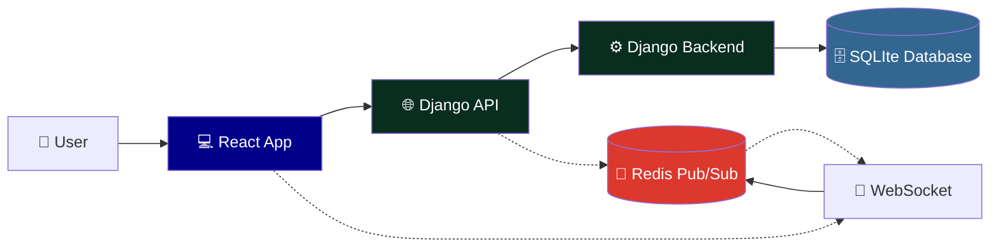
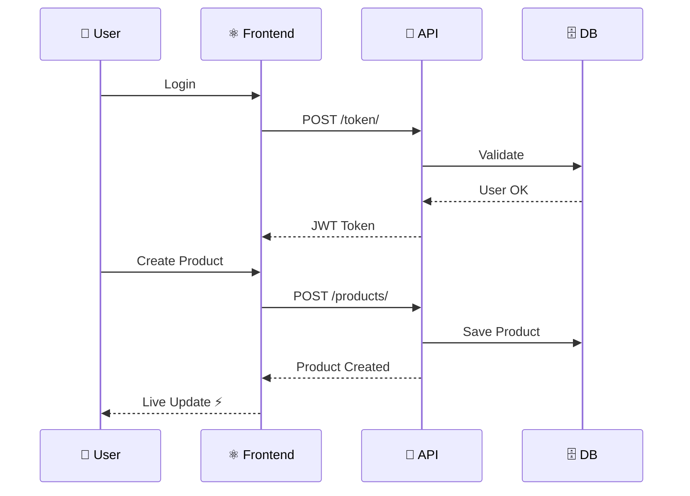
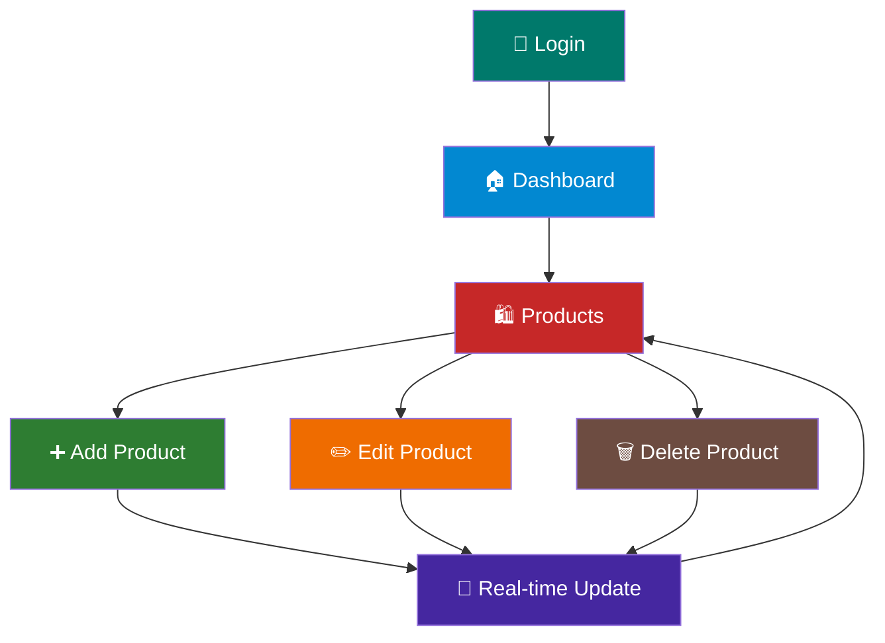

# Live Reloading Inventory Management System (LR 3.0)

[](#)
[](#)


[](#)
[](#)


[](#)


A full-stack, real-time inventory management system with live product updates via WebSockets and modern authentication.

## 🏗️ System Architecture



## 📊 Data Flow



## Simple Component Flow



## ✨ Features

### 🎯 Core Functionality

- **📦 Product Management**: CRUD operations for inventory items with image uploads
- **⚡ Real-time Updates**: Live WebSocket connections for instant product changes
- **🔐 User Authentication**: JWT-based auth with automatic token refresh
- **📱 Responsive UI**: Modern React interface with Tailwind CSS and Framer Motion animations
- **🔍 Advanced Filtering**: Search, category filtering, and sorting capabilities

### ⚙️ Technical Features

- **🛡️ Custom JWT WebSocket Middleware**: Secure WebSocket authentication using JWT tokens
- **📡 Django Signals Integration**: Automatic real-time notifications on model changes
- **🚧 Protected Routes**: Client-side route protection with automatic redirects
- **🖼️ Image Handling**: Product image uploads with media file management
- **🌐 CORS Support**: Configured for cross-origin frontend-backend communication

## 🛠️ Tech Stack

### 🐍 Backend

- **Django 5.2+** - 🌐 Web framework
- **Django REST Framework** - 🔧 API development
- **Django Channels** - 📡 WebSocket support
- **Daphne** - 🚀 ASGI server for WebSockets
- **Redis** - 💾 Channel layer backend
- **Simple JWT** - 🔐 Authentication
- **Pillow** - 🖼️ Image processing

### ⚛️ Frontend

- **React 18+** - 🎨 UI library
- **Vite 7.0+** - ⚡ Build tool and dev server
- **Tailwind CSS** - 💅 Styling framework
- **Framer Motion** - 🎬 Animations
- **Axios** - 📬 HTTP client
- **React Router** - 🗺️ Navigation
- **JWT Decode** - 🔓 Token handling

### 🗄️ Database & Infrastructure

- **SQLite** (default) or **PostgreSQL** - 📊 Database
- **Redis** - 📡 WebSocket channel layer
- **WhiteNoise** - 📁 Static file serving

## 📋 Prerequisites

- **🐍 Python 3.13+**
- **🟢 Node.js 16+** and npm
- **🔴 Redis server** (for WebSocket channel layer)
- **📝 Git**

## 🚀 Quick Start

### 1️⃣ Clone the Repository

```powershell
git clone https://github.com/kevinThulnith/live-reloading-inventory-management-system.git
cd live-reloading-inventory-management-system
```

### 2️⃣ Backend Setup

1. **🐍 Create and activate a virtual environment:**

   ```powershell
   python -m venv env
   .\env\Scripts\Activate.ps1
   ```

2. **📦 Install Python dependencies:**

   ```powershell
   pip install -e .
   ```

   _This installs the project and dependencies from `pyproject.toml`_

3. **⚙️ Configure environment variables:**

   Create a `.env` file in the project root:

   ```env
   DEBUG=True
   DJANGO_SECRET_KEY=your-secret-key-here
   DATABASE_URL=sqlite:///db.sqlite3
   REDIS_HOST=127.0.0.1
   REDIS_PORT=6379
   ```

4. **🗄️ Run database migrations:**

   ```powershell
   python backend/manage.py migrate
   ```

5. **👤 Create a superuser (optional):**

   ```powershell
   python backend/manage.py createsuperuser
   ```

6. **📦 Populate sample products (optional):**

   ```powershell
   python backend/manage.py populate_products
   ```

7. **🔴 Start Redis server** (ensure it's running on localhost:6379)

8. **🚀 Run the Django development server:**

   ```powershell
   python backend/manage.py runserver
   ```

   The API will be available at `http://localhost:8000`

### 3️⃣ Frontend Setup

1. **📁 Navigate to frontend directory:**

   ```powershell
   cd frontend
   ```

2. **📦 Install npm dependencies:**

   ```powershell
   npm install
   ```

3. **⚙️ Configure environment variables:**

   Create a `.env` file in the `frontend` directory:

   ```env
   VITE_API_URL=http://localhost:8000
   VITE_WS_URL=ws://localhost:8000
   ```

4. **🚀 Start the development server:**

   ```powershell
   npm run dev
   ```

   The frontend will be available at `http://localhost:5173`

## 🎯 API Endpoints

### 🔐 Authentication

- `POST /api/token/` - 🎫 Obtain JWT tokens
- `POST /api/token/refresh/` - 🔄 Refresh access token
- `POST /api/token/blacklist/` - 🚪 Logout (blacklist refresh token)
- `POST /api/user/register/` - 📝 User registration
- `GET /api/user/` - 👤 Get current user info

### 📦 Products

- `GET /api/products/` - 📋 List all products (with filtering, search, ordering)
- `POST /api/products/` - ➕ Create a new product
- `GET /api/products/{id}/` - 👁️ Retrieve a specific product
- `PUT/PATCH /api/products/{id}/` - ✏️ Update a product (owner only)
- `DELETE /api/products/{id}/` - 🗑️ Delete a product (owner only)
- `GET /api/products/my_products/` - 📄 List current user's products

### 📡 WebSocket

- `ws://localhost:8000/ws/products/?token={jwt_token}` - ⚡ Real-time product updates

## 🏗️ Project Architecture

### Backend Structure

```text
backend/
├── api/                    # Main application
│   ├── consumers.py       # WebSocket consumers
│   ├── middleware.py      # JWT WebSocket authentication
│   ├── models.py          # Product model
│   ├── permissions.py     # Custom permissions
│   ├── routing.py         # WebSocket URL routing
│   ├── serializers.py     # API serializers
│   ├── signals.py         # Real-time update signals
│   ├── views.py           # API viewsets
│   └── management/
│       └── commands/
│           └── populate_products.py  # Sample data command
└── backend/               # Django project settings
    ├── asgi.py           # ASGI configuration for WebSockets
    ├── settings.py       # Django settings
    └── urls.py           # URL configuration
```

### Frontend Structure

```text
frontend/
├── src/
│   ├── components/        # Reusable React components
│   │   ├── Navbar.jsx
│   │   ├── ProtectedRoute.jsx
│   │   └── LoadingIndicator.jsx
│   ├── pages/            # Page components
│   │   ├── Home.jsx      # Product listing with real-time updates
│   │   ├── Login.jsx     # Authentication
│   │   ├── Register.jsx  # User registration
│   │   ├── AddProduct.jsx
│   │   ├── UpdateProduct.jsx
│   │   └── MyProducts.jsx
│   ├── api.js            # Axios configuration
│   ├── constants.js      # JWT token constants
│   └── App.jsx           # Main app component
└── package.json
```

## 🔑 Key Features Explained

### ⚡ Real-time WebSocket Updates

The system uses Django Channels with custom JWT authentication middleware to provide secure, real-time updates:

- **🔐 Authentication**: WebSocket connections authenticate using JWT tokens passed as query parameters
- **📡 Signal Integration**: Django model signals automatically broadcast changes to connected clients
- **👥 Group Communication**: All connected users receive live updates when products are created, updated, or deleted

### 🎫 JWT Authentication Flow

1. 🔑 User logs in and receives access/refresh token pair
2. 💾 Frontend stores tokens in localStorage
3. 📬 API requests include Bearer token in Authorization header
4. 🔗 WebSocket connections authenticate via query parameter
5. 🔄 Tokens automatically refresh 5 minutes before expiration

### 📦 Product Management

- **🔧 CRUD Operations**: Full create, read, update, delete functionality
- **🖼️ Image Uploads**: Product images stored in media directory
- **👤 Owner Permissions**: Users can only modify their own products
- **🔍 Advanced Filtering**: Search by name/description, filter by category, sort by various fields

## 🧪 Testing WebSocket Functionality

A test HTML file (`ws_test.html`) is included for WebSocket testing:

1. 🚀 Start the Django server
2. 🌐 Open `ws_test.html` in a browser
3. ➕ Create/update/delete products in Django Admin
4. 👀 See real-time updates in the test page

## 🛠️ Development

### 🔧 Running in Development Mode

**🐍 Backend (Django with auto-reload):**

```powershell
python backend/manage.py runserver
```

**⚛️ Frontend (Vite with HMR):**

```powershell
cd frontend
npm run dev
```

### 🏗️ Building for Production

**⚛️ Frontend:**

```powershell
cd frontend
npm run build
```

The built files will be in `frontend/dist/`

## 🔧 Configuration

### ⚙️ Environment Variables

**🐍 Backend (.env):**

```env
DEBUG=True
DJANGO_SECRET_KEY=your-secret-key
DATABASE_URL=sqlite:///db.sqlite3
REDIS_HOST=127.0.0.1
REDIS_PORT=6379
```

**⚛️ Frontend (.env):**

```env
VITE_API_URL=http://localhost:8000
VITE_WS_URL=ws://localhost:8000
```

## 📝 License

This project is licensed under the MIT License. Feel free to fork and modify as needed. 🎉
